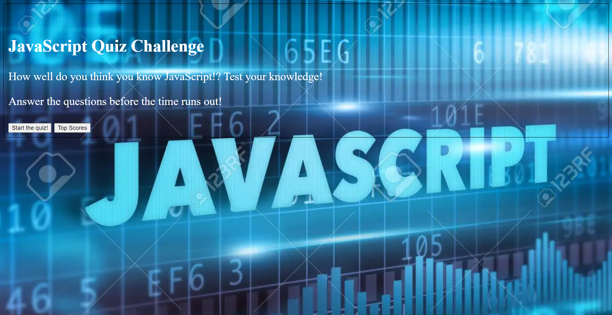
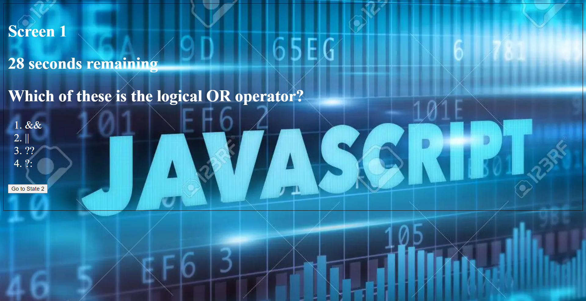

# 04-Web-Api-Quiz-Challenge

## Description 

The purpose of this program is to simulate how using JavaScript in combination with HTML and CSS can make a program become dynamic instead of just static. In this program there will be different states of html being shown and hidden. There will be use of the local storage. There will be all kinds of different aspects of javaScript being applied, including math formulas, methods, properties, and more. This program illustrates how you can take all these concepts and create a dynamic quiz game that saves statistics every time you play.

## Mock-Up

The following image shows a demonstration of what the finished web application's presentation and functionality will include:

## Prerequisites

Before you continue, make sure you have the following requirements:

- You have Visual Studio Code downloaded.
- You are using a MAC OS or Windows machine.
- You have a basic understanding of HTML and CSS.
- You have a basic understanding of JavaScript.
- You have a basic understanding of web api's.

## Links

[This is a URL link to the deployed application.](https://bungycode.github.io/04-web-api-quiz-challenge/)

[This is a URL link to the github repository](https://github.com/Bungycode/04-web-api-quiz-challenge)